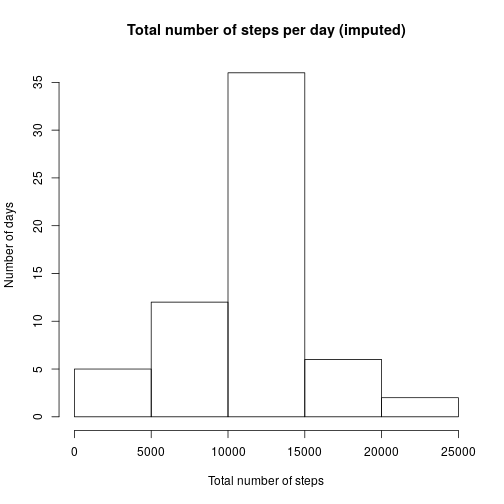

## Loading and preprocessing the data


```r
activity_monitoring_data <- read.csv("data/activity.csv")
activity_monitoring_data <- mutate(activity_monitoring_data, 
                                   date = as.Date(date))
head(activity_monitoring_data)
```

```
##   steps       date interval
## 1    NA 2012-10-01        0
## 2    NA 2012-10-01        5
## 3    NA 2012-10-01       10
## 4    NA 2012-10-01       15
## 5    NA 2012-10-01       20
## 6    NA 2012-10-01       25
```

```r
str(activity_monitoring_data)
```

```
## 'data.frame':	17568 obs. of  3 variables:
##  $ steps   : int  NA NA NA NA NA NA NA NA NA NA ...
##  $ date    : Date, format: "2012-10-01" "2012-10-01" ...
##  $ interval: int  0 5 10 15 20 25 30 35 40 45 ...
```

```r
summary(activity_monitoring_data)
```

```
##      steps             date               interval     
##  Min.   :  0.00   Min.   :2012-10-01   Min.   :   0.0  
##  1st Qu.:  0.00   1st Qu.:2012-10-16   1st Qu.: 588.8  
##  Median :  0.00   Median :2012-10-31   Median :1177.5  
##  Mean   : 37.38   Mean   :2012-10-31   Mean   :1177.5  
##  3rd Qu.: 12.00   3rd Qu.:2012-11-15   3rd Qu.:1766.2  
##  Max.   :806.00   Max.   :2012-11-30   Max.   :2355.0  
##  NA's   :2304
```

## What is mean total number of steps taken per day?


```r
total_number_of_steps_per_day <- with(activity_monitoring_data, 
                                      tapply(steps, date, sum, na.rm = TRUE))
hist(total_number_of_steps_per_day, 
     main = 'Total number of steps per day', 
     xlab = 'Total number of steps', ylab = 'Number of days')
```


### Mean of total number of steps per day


```r
mean(total_number_of_steps_per_day, na.rm = TRUE)
```

```
## [1] 9354.23
```

### Median of total number of steps per day


```r
median(total_number_of_steps_per_day, na.rm = TRUE)
```

```
## [1] 10395
```

## What is the average daily activity pattern?


```r
average_daily_activity_pattern <- with(activity_monitoring_data, 
                                      tapply(steps, interval, mean, na.rm = TRUE))
plot(names(average_daily_activity_pattern), average_daily_activity_pattern, 
     main = 'Average daily activity pattern', 
     xlab = 'Daily time interval [5 min]', ylab = 'Average daily number of steps', 
     type = 'l', lwd = 1)
```


### Interval with maximal average daily number of steps and corresponding value


```r
average_daily_activity_pattern[which.max(as.numeric(average_daily_activity_pattern))]
```

```
##      835 
## 206.1698
```

## Imputing missing values

### Total number of missing values in the dataset


```r
na_row_indices <- as.logical(rowSums(is.na(activity_monitoring_data)))
sum(na_row_indices)
```

```
## [1] 2304
```

### Filling in missing values by mean of total number of steps


```r
activity_monitoring_data_imputed <- mutate(activity_monitoring_data, steps = impute(steps, mean))
```

### Imputing strategy shifts considerate fraction of days towards middle of histogram


```r
total_number_of_steps_per_day_imputed <- with(activity_monitoring_data_imputed, 
                                      tapply(steps, date, sum, na.rm = TRUE))
hist(total_number_of_steps_per_day_imputed, 
     main = 'Total number of steps per day (imputed)', 
     xlab = 'Total number of steps', ylab = 'Number of days')
```



### Imputing strategy increases mean and median slightly


```r
mean(total_number_of_steps_per_day_imputed, na.rm = TRUE)
```

```
## [1] 10766.19
```

```r
median(total_number_of_steps_per_day_imputed, na.rm = TRUE)
```

```
## [1] 10766.19
```

## Are there differences in activity patterns between weekdays and weekends?

### Create new factor variable type.of.day with values "weekday" and "weekend"


```r
activity_monitoring_data <- mutate(activity_monitoring_data, type.of.day = "weekday")
weekend_indices <- weekdays(activity_monitoring_data$date) %in% c("Saturday", "Sunday")
activity_monitoring_data[weekend_indices, ]$type.of.day <- "weekend"
activity_monitoring_data <- mutate(activity_monitoring_data, type.of.day = as.factor(type.of.day))
```

### Average daily activity pattern: weekdays vs. weekends


```r
par(oma = c(0, 0, 2, 0))
par(mfrow = c(1, 2))
average_daily_activity_pattern_weekday <- with(activity_monitoring_data[activity_monitoring_data$type.of.day == "weekday", ], 
                                               tapply(steps, interval, mean, na.rm = TRUE))
average_daily_activity_pattern_weekend <- with(activity_monitoring_data[activity_monitoring_data$type.of.day == "weekend", ], 
                                               tapply(steps, interval, mean, na.rm = TRUE))
plot(names(average_daily_activity_pattern_weekday), average_daily_activity_pattern_weekday, 
     main = 'Weekdays', 
     xlab = 'Daily time interval [5 min]', ylab = 'Average daily number of steps', 
     type = 'l', lwd = 1, lty = 1, ylim = c(0, 250))
plot(names(average_daily_activity_pattern_weekend), average_daily_activity_pattern_weekend, 
     main = 'Weekends', 
     xlab = 'Daily time interval [5 min]', ylab = 'Average daily number of steps', 
     type = 'l', lwd = 1, lty = 1, ylim = c(0, 250))
title("Average daily activity pattern", outer=TRUE)
```


